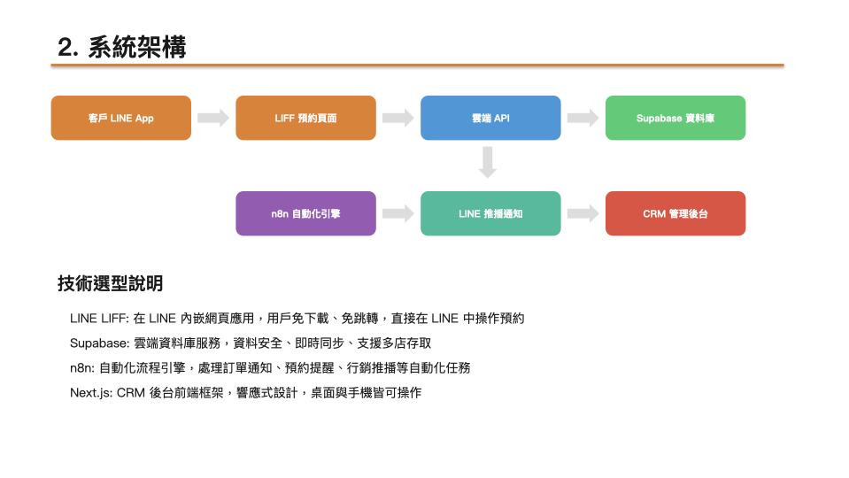
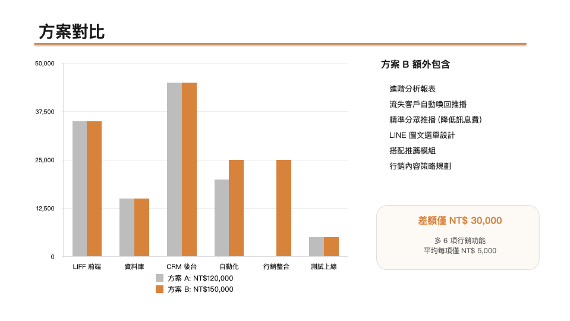
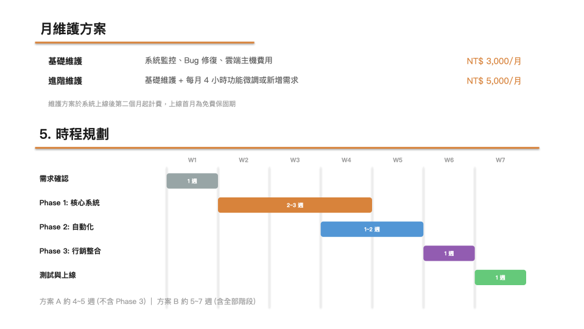
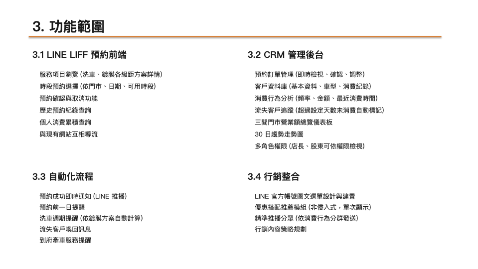

# transcribe-proposal

錄音轉提案：會議錄音一鍵轉成專業 PPTX 提案簡報。

把客戶諮詢錄音丟進去，自動完成轉錄、AI 分析、產出結構化提案簡報。適合自由工作者、顧問、一人公司。

[繁體中文](#功能) | [English](#english) | [日本語](#日本語)

### 產出範例

<p align="center">
  
</p>
<p align="center">
  
</p>
<p align="center">
  
</p>

---

## 功能

- 音訊轉文字 (OpenAI Whisper API)
- AI 自動分析會議內容，提取需求、共識、報價
- 產出 9 頁結構化 PPTX 提案簡報
- 可自訂範本 (顏色、字體、公司資訊)
- 支援 Claude Code Skill 進階工作流

## 安裝前置條件

- Node.js 18+
- Python 3.8+
- OpenAI API Key

## 使用方式

### 快速開始

```bash
# 設定 API Key
export OPENAI_API_KEY=sk-...

# 安裝 Python 依賴
pip3 install python-pptx

# 一鍵執行
npx transcribe-proposal meeting.mp3
```

### 完整選項

```bash
# 指定輸出路徑和語言
npx transcribe-proposal meeting.mp3 --output my-proposal.pptx --lang zh

# 使用現有逐字稿 (跳過轉錄)
npx transcribe-proposal --transcript meeting.txt --output proposal.pptx

# 只轉錄，不產出簡報
npx transcribe-proposal meeting.mp3 --transcribe-only

# 使用自訂範本
npx transcribe-proposal meeting.mp3 --template my-theme.json

# 指定 GPT 模型
npx transcribe-proposal meeting.mp3 --model gpt-4o
```

### 支援的音訊格式

mp3, m4a, wav, ogg, flac, mp4, webm, mpeg, mpga, oga

檔案大小限制: 25MB (超過請先壓縮: `ffmpeg -i input.mp3 -b:a 64k -ar 16000 output.mp3`)

## 運作原理

```
音訊檔 (.mp3)
  |
  v
[OpenAI Whisper API] -- 語音轉文字
  |
  v
逐字稿 (.txt)
  |
  v
[GPT-4o-mini] -- 結構化分析 (需求、報價、時程)
  |
  v
結構化 JSON
  |
  v
[python-pptx] -- 套用範本渲染
  |
  v
提案簡報 (.pptx)
```

## 簡報結構

產出的 PPTX 包含 9 頁:

1. 封面 (提案名稱、日期)
2. 專案背景與目標
3. 系統架構
4. 功能範圍
5. 方案 A 報價
6. 方案 B 報價 (推薦)
7. 月維護 + 時程規劃
8. 付款方式 + 服務條款
9. 為什麼選擇我們 + 聯絡資訊

## 自訂範本

建立 JSON 檔案覆寫預設設定:

```json
{
  "colors": {
    "primary": "#3498DB"
  },
  "fonts": {
    "primary": "Microsoft JhengHei"
  },
  "company": {
    "name": "你的名字",
    "title": "你的職稱",
    "website": "example.com"
  }
}
```

只需要填寫要修改的欄位，其他會使用預設值。

完整預設設定參考: [templates/default.json](templates/default.json)

## Claude Code 整合

如果你使用 Claude Code，可以安裝 Skill 獲得完整 AI 工作流:

```bash
# 複製 Skill 到你的專案
cp -r .claude/skills/transcribe-proposal YOUR_PROJECT/.claude/skills/

# 在 Claude Code 中使用
/transcribe-proposal ~/Downloads/meeting.mp3
```

Claude Code Skill 會額外提供:
- 智慧會議內容分析
- 自動建立專案文件
- 互動式報價確認
- 脈絡與決策日誌更新

## API 費用估算

| 步驟 | 模型 | 30 分鐘會議費用 |
|------|------|----------------|
| 轉錄 | Whisper | ~$0.18 |
| 分析 | GPT-4o-mini | ~$0.01 |
| **合計** | | **~$0.19** |

## 字體設定

預設使用 PingFang TC (macOS 內建)。其他系統:

- **Windows**: 在範本中設定 `"primary": "Microsoft JhengHei"`
- **Linux**: 在範本中設定 `"primary": "Noto Sans TC"`

---

## English

### What It Does

transcribe-proposal is a CLI tool that converts meeting audio recordings into professional PPTX proposal presentations. It automates the entire workflow from raw audio to a polished, structured slide deck, designed for freelancers, consultants, and solo entrepreneurs.

**The pipeline:**

1. **Transcribe** your meeting audio using OpenAI Whisper API (supports 50+ languages)
2. **Analyze** the transcript with GPT to extract structured data: client needs, proposed solutions, pricing, timelines, and action items
3. **Generate** a professional 9-slide PPTX proposal with your branding

### Prerequisites

- Node.js 18 or later
- Python 3.8 or later
- An OpenAI API key ([get one here](https://platform.openai.com/api-keys))

### Quick Start

```bash
# 1. Set your API key
export OPENAI_API_KEY=sk-...

# 2. Install Python dependency
pip3 install python-pptx

# 3. Run it
npx transcribe-proposal meeting.mp3
```

That's it. A `proposal.pptx` file will be generated in your current directory.

### All Options

```
Usage:
  transcribe-proposal <audio-file> [options]
  transcribe-proposal --transcript <text-file> [options]

Options:
  --output, -o <path>       Output PPTX path (default: proposal.pptx)
  --transcript, -t <path>   Use existing transcript, skip transcription
  --transcribe-only         Only transcribe, don't analyze or generate slides
  --lang <code>             Transcription language (default: zh)
  --template <path>         Custom template JSON file
  --model <name>            GPT model for analysis (default: gpt-4o-mini)
  --api-key <key>           OpenAI API Key (or set OPENAI_API_KEY env var)
  --help, -h                Show help
  --version, -v             Show version
```

### Usage Examples

```bash
# Basic: audio in, proposal out
npx transcribe-proposal meeting.mp3

# Specify output path and language
npx transcribe-proposal meeting.mp3 --output client-proposal.pptx --lang en

# Already have a transcript? Skip transcription
npx transcribe-proposal --transcript meeting-notes.txt --output proposal.pptx

# Only transcribe, don't generate slides
npx transcribe-proposal meeting.mp3 --transcribe-only

# Use a custom template with your branding
npx transcribe-proposal meeting.mp3 --template my-brand.json

# Use a more powerful model for analysis
npx transcribe-proposal meeting.mp3 --model gpt-4o
```

### Supported Audio Formats

mp3, m4a, wav, ogg, flac, mp4, webm, mpeg, mpga, oga

File size limit: 25MB. If your file is larger, compress it first:

```bash
ffmpeg -i input.mp3 -b:a 64k -ar 16000 output.mp3
```

### How It Works

```
Audio file (.mp3)
  |
  v
[OpenAI Whisper API] -- Speech-to-text transcription
  |
  v
Transcript (.txt)
  |
  v
[GPT-4o-mini] -- Structured extraction (needs, pricing, timeline)
  |
  v
Structured JSON
  |
  v
[python-pptx] -- Render with template
  |
  v
Proposal (.pptx)
```

### Proposal Structure

<p align="center">
  
  
</p>
<p align="center">
  
  
</p>

The generated PPTX contains 9+ slides:

1. **Cover** - Proposal title, date, your info
2. **Background & Goals** - Client situation and project objectives
3. **Architecture** - System design and tech stack
4. **Features** - Categorized feature breakdown
5. **Plan A** - Basic pricing with itemized costs
6. **Plan B** - Full pricing (marked as recommended)
7. **Maintenance & Timeline** - Monthly plans and project phases
8. **Payment & Terms** - Payment schedule and service conditions
9. **Why Us & Contact** - Your strengths and contact info

### Custom Templates

Create a JSON file to override any default setting:

```json
{
  "colors": {
    "primary": "#3498DB"
  },
  "fonts": {
    "primary": "Arial"
  },
  "company": {
    "name": "Your Name",
    "title": "Consultant",
    "website": "example.com"
  }
}
```

Pass it with `--template my-brand.json`. Only the fields you specify are overridden; everything else uses the defaults.

See the full default config: [templates/default.json](templates/default.json)

### Font Configuration

The default font is PingFang TC (built into macOS). For other operating systems:

- **Windows**: Set `"primary": "Microsoft JhengHei"` or `"primary": "Arial"` in your template
- **Linux**: Set `"primary": "Noto Sans TC"` or `"primary": "DejaVu Sans"` in your template

### API Cost Estimate

| Step | Model | Cost per 30-min meeting |
|------|-------|------------------------|
| Transcription | Whisper | ~$0.18 |
| Analysis | GPT-4o-mini | ~$0.01 |
| **Total** | | **~$0.19** |

### Claude Code Integration

If you use [Claude Code](https://claude.com/claude-code), install the included Skill for a fully interactive AI-powered workflow:

```bash
# Copy the Skill into your project
cp -r .claude/skills/transcribe-proposal YOUR_PROJECT/.claude/skills/

# Use it in Claude Code
/transcribe-proposal ~/Downloads/meeting.mp3
```

The Claude Code Skill adds:
- Intelligent meeting analysis with deeper context understanding
- Automatic project folder and documentation creation
- Interactive pricing confirmation dialog
- Context and decision log updates

---

## 日本語

### 概要

transcribe-proposal は、会議の音声録音をプロフェッショナルな PPTX 提案書に自動変換する CLI ツールです。フリーランス、コンサルタント、個人事業主向けに設計されています。

**処理の流れ:**

1. **文字起こし**: OpenAI Whisper API で音声をテキストに変換 (50以上の言語に対応)
2. **AI 分析**: GPT が議事録から構造化データを抽出 (顧客ニーズ、提案内容、見積もり、スケジュール)
3. **スライド生成**: python-pptx でテンプレートに沿った 9 ページの提案書を出力

### 前提条件

- Node.js 18 以降
- Python 3.8 以降
- OpenAI API キー ([こちらで取得](https://platform.openai.com/api-keys))

### クイックスタート

```bash
# 1. API キーを設定
export OPENAI_API_KEY=sk-...

# 2. Python 依存パッケージをインストール
pip3 install python-pptx

# 3. 実行
npx transcribe-proposal meeting.mp3
```

カレントディレクトリに `proposal.pptx` が生成されます。

### 全オプション

```
使い方:
  transcribe-proposal <音声ファイル> [オプション]
  transcribe-proposal --transcript <テキストファイル> [オプション]

オプション:
  --output, -o <パス>       出力 PPTX パス (デフォルト: proposal.pptx)
  --transcript, -t <パス>   既存の議事録を使用 (文字起こしをスキップ)
  --transcribe-only         文字起こしのみ実行 (分析・スライド生成なし)
  --lang <コード>           文字起こし言語 (デフォルト: zh)
  --template <パス>         カスタムテンプレート JSON ファイル
  --model <名前>            分析用 GPT モデル (デフォルト: gpt-4o-mini)
  --api-key <キー>          OpenAI API キー (または OPENAI_API_KEY 環境変数)
  --help, -h                ヘルプを表示
  --version, -v             バージョンを表示
```

### 使用例

```bash
# 基本: 音声ファイルから提案書を生成
npx transcribe-proposal meeting.mp3

# 出力パスと言語を指定
npx transcribe-proposal meeting.mp3 --output proposal.pptx --lang ja

# 既存の議事録から提案書を生成 (文字起こしをスキップ)
npx transcribe-proposal --transcript meeting-notes.txt --output proposal.pptx

# 文字起こしのみ
npx transcribe-proposal meeting.mp3 --transcribe-only

# カスタムテンプレートを使用
npx transcribe-proposal meeting.mp3 --template my-brand.json

# より高性能なモデルで分析
npx transcribe-proposal meeting.mp3 --model gpt-4o
```

### 対応音声フォーマット

mp3, m4a, wav, ogg, flac, mp4, webm, mpeg, mpga, oga

ファイルサイズ上限: 25MB。超える場合は事前に圧縮してください:

```bash
ffmpeg -i input.mp3 -b:a 64k -ar 16000 output.mp3
```

### 処理フロー

```
音声ファイル (.mp3)
  |
  v
[OpenAI Whisper API] -- 音声からテキストへ変換
  |
  v
議事録 (.txt)
  |
  v
[GPT-4o-mini] -- 構造化分析 (ニーズ、見積もり、スケジュール)
  |
  v
構造化 JSON
  |
  v
[python-pptx] -- テンプレートでレンダリング
  |
  v
提案書 (.pptx)
```

### 提案書の構成

<p align="center">
  
  
</p>

生成される PPTX は 9 ページ以上で構成されます:

1. **表紙** - 提案タイトル、日付、提案者情報
2. **背景と目標** - クライアントの状況とプロジェクト目標
3. **システム構成** - システム設計と技術スタック
4. **機能範囲** - カテゴリ別の機能一覧
5. **プラン A** - 基本プランの見積もり明細
6. **プラン B** - フルプランの見積もり (推奨マーク付き)
7. **保守・スケジュール** - 月額保守プランと開発フェーズ
8. **支払い・契約条件** - 支払いスケジュールとサービス条件
9. **なぜ私たちか・連絡先** - 強みと連絡先情報

### カスタムテンプレート

JSON ファイルでデフォルト設定を上書きできます:

```json
{
  "colors": {
    "primary": "#3498DB"
  },
  "fonts": {
    "primary": "Yu Gothic"
  },
  "company": {
    "name": "あなたの名前",
    "title": "コンサルタント",
    "website": "example.com"
  }
}
```

`--template my-brand.json` で指定します。指定したフィールドのみ上書きされ、それ以外はデフォルト値が使用されます。

デフォルト設定の全体は [templates/default.json](templates/default.json) を参照してください。

### フォント設定

デフォルトフォントは PingFang TC (macOS 内蔵) です。他の OS の場合:

- **Windows**: テンプレートで `"primary": "Yu Gothic"` または `"primary": "Meiryo"` に設定
- **Linux**: テンプレートで `"primary": "Noto Sans JP"` に設定

### API コスト見積もり

| ステップ | モデル | 30分の会議あたりのコスト |
|----------|--------|------------------------|
| 文字起こし | Whisper | 約 $0.18 |
| 分析 | GPT-4o-mini | 約 $0.01 |
| **合計** | | **約 $0.19** |

### Claude Code 連携

[Claude Code](https://claude.com/claude-code) をお使いの場合、同梱の Skill をインストールすることで、完全にインタラクティブな AI ワークフローが利用できます:

```bash
# Skill をプロジェクトにコピー
cp -r .claude/skills/transcribe-proposal YOUR_PROJECT/.claude/skills/

# Claude Code で使用
/transcribe-proposal ~/Downloads/meeting.mp3
```

Claude Code Skill の追加機能:
- より深いコンテキスト理解による会議分析
- プロジェクトフォルダとドキュメントの自動作成
- インタラクティブな見積もり確認
- コンテキストと意思決定ログの更新

---

## License

MIT
